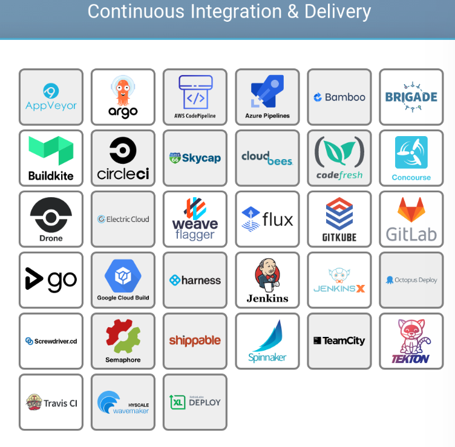
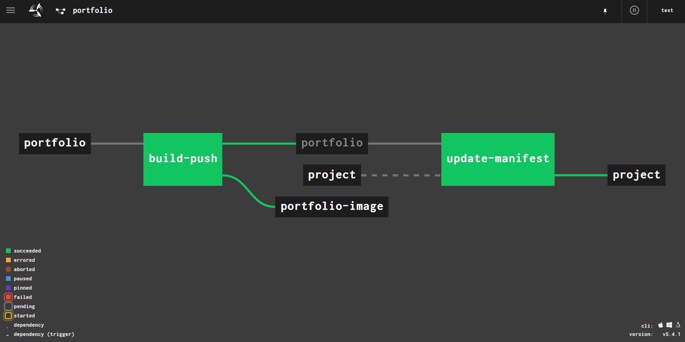
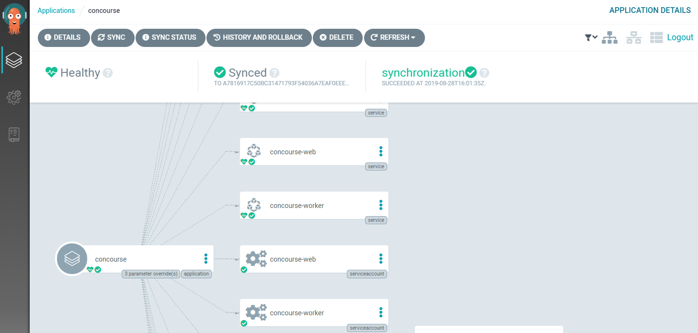
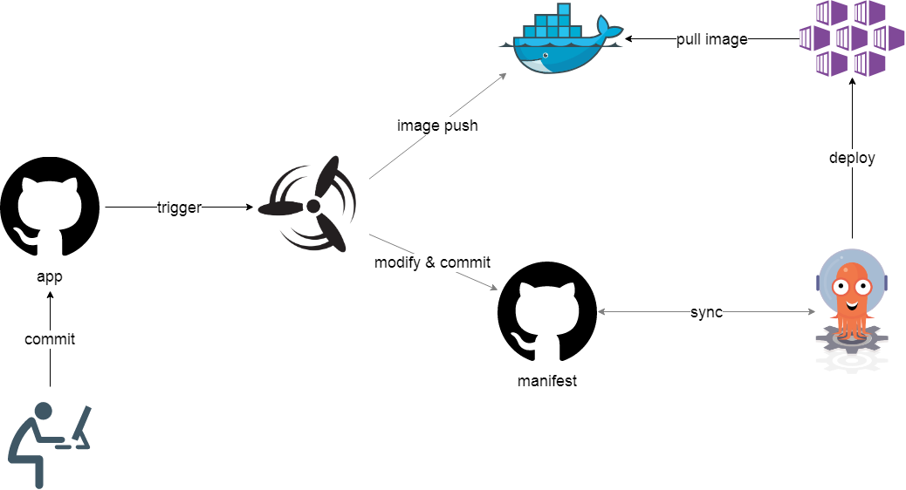

class: center, middle, inverse
### Introduction of Cloud Native CI/CD on Kubernetes

---
exclude: true
### whoami

.left-small[
    
]

.right-large[
- Kyohei Mizumoto(@kyohmizu)

- C# Software Engineer

- Interests
    - Docker/Kubernetes
    - Go
    - Security
]

---
### Trail Map

.zoom1[
    <u><https://github.com/cncf/trailmap></u>
]

<center></center>

---
### CI/CD

From the trail map:

```txt
Setup Continuous Integration/Continuous Delivery  
(CI/CD) so that changes to your source code  
automatically result in a new container being  
built, tested, and deployed to staging and  
eventually, perhaps, to production
```

---
### Landscape

.zoom1[
    <u><https://github.com/cncf/landscape></u>
]

<center></center>

---
class: header-margin
### Landscape

<center></center>

---
### CI/CD on Kubernetes

.zoom1[
<br/>
]

.left-half[
    <center></center>
]

.right-half[
    <center></center>
]

---
### Concourse CI

<u><https://concourse-ci.org/></u>

.left-large[
- Pipeline-based CI tool

- Configuration as Code

- Fancy Visualization

- Management using CLI tool
]

.right-small[
    <center></center>
]

---
### Get Started

<u><https://github.com/helm/charts/tree/master/stable/concourse></u>

- TL;DR;

```bash
$ helm install stable/concourse
```

- Need to set `externalUrl` to access from outside

- Install the `fly` CLI tool for concourse management

```bash
$ fly -h
```

---
### Pipeline

.zoom0[
<u><https://github.com/starkandwayne/concourse-tutorial/blob/master/tutorials/basic/job-inputs/pipeline.yml></u>

```yaml
resources:
  - name: resource-tutorial
    type: git
    source:
      uri: https://github.com/starkandwayne/concourse-tutorial.git
      branch: develop

  - name: resource-app
    type: git
    source:
      uri: https://github.com/cloudfoundry-community/simple-go-web-app.git

jobs:
  - name: job-test-app
    public: true
    plan:
      - get: resource-tutorial
      - get: resource-app
        trigger: true
      - task: web-app-tests
        file: resource-tutorial/tutorials/basic/job-inputs/task_run_tests.yml
```
]

---
class: header-margin
### Pipeline

<center></center>

---
### Argo CD

<u><https://argoproj.github.io/argo-cd/></u>

.left-large[
- Declarative, GitOps CD tool

- Automated deployment of desired application states

- Support for config management tools  
(Kustomize, Helm etc)
]

.right-small[
    <center></center>
]

---
### Get Started

- Quick start

.zoom1[
```bash
$ kubectl create namespace argocd
$ kubectl apply -n argocd -f \
https://raw.githubusercontent.com/argoproj/argo-cd/stable/manifests/install.yaml
```
]

- Access the endpoint by browser & Login

- Get admin password

.zoom1[
```bash
$ kubectl get pods -n argocd -l app.kubernetes.io/name=argocd-server \
-o name | cut -d'/' -f 2
```
]

---
class: header-margin
### Application

<center></center>

---
class: header-margin
### Application Manifest

.zoom0[
```yaml
apiVersion: argoproj.io/v1alpha1
kind: Application
metadata:
  name: concourse
  namespace: argocd
spec:
  project: default
  source:
    repoURL: https://github.com/helm/charts.git
    targetRevision: a7816917c50bc31471793f54036a7eaf0eeeb701
    path: stable/concourse
    helm:
      parameters:
      - name: "web.service.type"
        value: "LoadBalancer"
      - name: "concourse.web.bindPort"
        value: "80"
      - name: "concourse.web.externalUrl"
        value: ${URL}
      releaseName: concourse
  destination:
    server: https://kubernetes.default.svc
    namespace: default
```
]

---
### CI/CD Architecture

.zoom2[
In my self-study project
]

<center></center>

---
class: center, middle, blue
# Demo

---
class: center, middle, blue
# Thank you!
